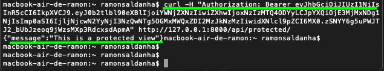
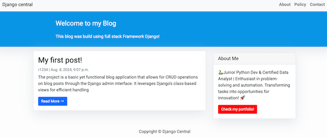
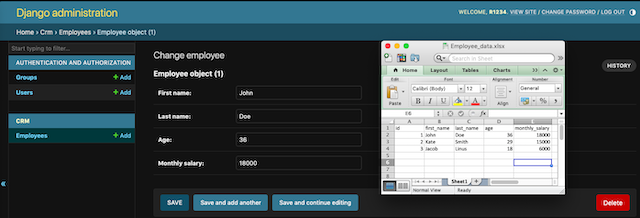
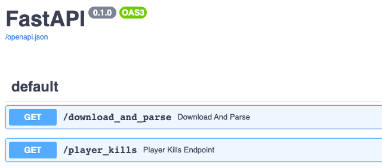
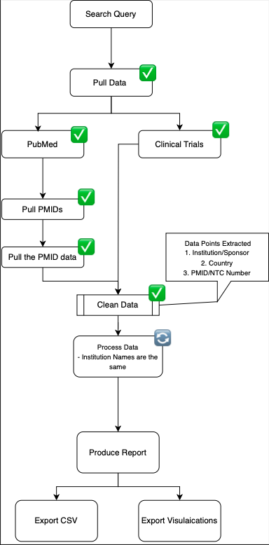

# [☁️ Cloud Projects](https://github.com/elrf3lipes/serverless_tasks_api)

## Overview

Serverless CRUD API for managing tasks, built with AWS CDK using Python. It leverages AWS services such as API Gateway, Lambda, and DynamoDB to provide a scalable and serverless backend for task management.

```markdown
## Requisites:
- Node.js
- npm (latest)
- Python (3.x)
- AWS CLI (latest)
- AWS CDK (latest)
- AWS account profile with access key and secret key configured

## Attributes:
- API Gateway that exposes the REST API
- Lambda Functions that handle the CRUD operations
- DynamoDB Table to store task data

## How to deploy
```bash
git clone https://github.com/elrf3lipes/serverless_tasks_api
cd serverless_tasks_api
cdk bootstrap "aws://<account>/<region>"
cdk synth
cdk deploy
```

## How to test using curl:

- **Create a task**:
```bash
curl -X POST https://<api-url>/tasks \
  -H "Content-Type: application/json" \
  -d '{"title": "New Task", "description": "Task description", "status": "pending"}'
```

- **Get a task**:
```bash
curl https://<api-url>/tasks/<taskId>
```

- **Update a task**:
```bash
curl -X PUT https://<api-url>/tasks/<taskId> \
  -H "Content-Type: application/json" \
  -d '{"title": "Updated Task", "description": "This task has been updated", "status": "completed"}'
```

- **Delete a task**:
```bash
curl -X DELETE https://<api-url>/tasks/<taskId>
```

- **Example of Curl commands and Responses**:


# [🖥️ Backend/Web Development Projects](https://github.com/elrf3lipes/Django_concepts)

## Overview

Core concepts of Django backend development, including server-side logic, RESTful and Fast APIs, user authentication, content management, comment systems, token authorization, admin integration, containerization, real-time data management, CI/CD automation.

**[Dockerized_Django_API](https://github.com/elrf3lipes/Django_concepts/tree/main/Django_API)** is an API development project leveraging Django's REST framework to create secure, scalable endpoints. This project integrates powerful libraries such as Django REST framework, Django Filters, and DRF's token authentication to implement comprehensive CRUD operations, authentication, pagination, and filtering. The project is Dockerized for easy deployment, with a Dockerfile that sets up the environment and runs the Django application, facilitating containerization and management.



**[Django_blog](https://github.com/elrf3lipes/Django_concepts/tree/main/Django_blog)** is a full-featured blogging platform built with Django, providing user-friendly content management and interactive features. It incorporates Django's built-in authentication system, along with tagging, commenting, and categorization functionalities, making it a versatile tool for managing blog content.



**[Django_CRM](https://github.com/elrf3lipes/Django_concepts/tree/main/import-export)** is a streamlined CRM application focused on data import and export functionality, integrated with Django's admin interface. This project utilizes key libraries like Pandas, Django Import-Export, and various file handling modules to facilitate data import/export in formats like CSV and Excel, ensuring easy data management and validation.



## Motivation

Having a background in Data Analysis I've noticed a demand for backend solutions where you need to easily deploy CRM applications for data management and general CRUD operations, again my main goal was to get practical experience in developing such applications. For Django blog the idea was to build something that offers user-friendly content management and get experience in full-stack Django development.

## Acknowledgments

- Server-Side Logic
- RESTful API Development
- Database Management
- Token-Based Authentication
- Data Processing
- Containerization

**[Quake3 log parser](https://github.com/elrf3lipes/quake3_log_parser)** This project is a Quake 3 Arena log parser designed to read and analyze game log files in real time through its FastAPI. It provides functionalities to parse logs, track game statistics, and generate detailed reports. A CI/CD pipeline automates the process of linting, testing, and building a Docker image whenever changes are pushed or pulled:




## Motivation
This project was aimed at gaining hands-on experience in developing applications that manage real-time data, automate processes, and generate insights from raw logs. My main goal was to apply modular development practices while enhancing my knowledge in automated deployment pipelines.
 
## Acknowledgments

- Log Data Parsing & Processing
- Real-time Data Management via FastAPI
- CI/CD Pipeline Integration (GitHub Actions)
- Modular Application Development
- Dockerization
- Automated Testing & Linting


# [📊 API-Data Extraction Project](https://github.com/elrf3lipes/Python_Automation_Projects/blob/master/Pubmed_Clinical_Trials_data_extraction_1.ipynb)

## Overview

**Pubmed_Clinical_Trials_data_extraction_1** is a comprehensive data extraction and parsing tool that integrates with [Pubmed](https://www.ncbi.nlm.nih.gov/home/develop/api/) and [ClinicalTrials](https://clinicaltrials.gov/data-api/api) APIs. This project utilizes powerful Python libraries including Entrez, Medline, Biopython, Requests, urllib, xml.etree, IPython, and Pandas to streamline the process of fetching and processing clinical trials data.



## Features

- **API Integration**: Seamless integration with Pubmed and ClinicalTrials APIs to fetch relevant clinical trials data.
- **Data Parsing**: Efficient parsing of XML data using 'xml.etree'.
- **Data Manipulation**: Advanced data manipulation and analysis using Pandas.
- **Interactive Environment**: Utilizes IPython for an interactive coding experience.

## Libraries Used

- **[Biopython](https://biopython.org/)**: For handling biological data.
- **[Requests](https://pypi.org/project/requests/)**: For making HTTP requests to APIs.
- **[urllib](https://docs.python.org/3/library/urllib.html)**: For URL handling.
- **[xml.etree](https://docs.python.org/3/library/xml.etree.elementtree.html)**: For parsing XML data.
- **[IPython](https://ipython.readthedocs.io/en/stable/)**: For interactive computing.
- **[Pandas](https://pypi.org/project/pandas/)**: For data manipulation and analysis.
- **[Entrez](https://biopython.org/docs/1.75/api/Bio.Entrez.html)**: For accessing NCBI databases.
- **[Medline](https://biopython.org/docs/1.75/api/Bio.Medline.html)**: For parsing Medline records.

## Motivation

I decided to start on Upwork projects just for learning and then present them to the clients, the reason I made it public is because during its development, I encountered numerous posts from people looking for similar solutions. By sharing this tool, I hope to assist others in achieving the same goals of efficiently extracting pubmed and clinical trials research affiliations.

## How to Use

1. Clone the repository:
   
   ```git clone https://github.com/elrf3lipes/Python_Automation_Projects.git```

3. Navigate to the project directory:

   ```cd Python_Automation_Projects```

5. Open the Jupyter Notebook:

   ```jupyter notebook Pubmed_Clinical_Trials_data_extraction_1.ipynb```

Follow the instructions within the notebook to execute the data extraction and parsing processes.

## Conclusion

This project aims to simplify the process of extracting the affiliation data from [Pubmed](https://pubmed.ncbi.nlm.nih.gov/) and [ClinicalTrials](https://clinicaltrials.gov/) APIs. By leveraging powerful Python libraries, it provides a small solution for researchers and developers working in the field of clinical data analysis.

**Note**: The affiliation parser and keyword counter (`extract_phrases_and_countries` function) may encounter many limitations due to varying XML structures from PubMed. I planned to use the OpenAI API to improve parsing, but development stopped when my client went silent. Still, I hope this tool helps others looking for similar solutions!
