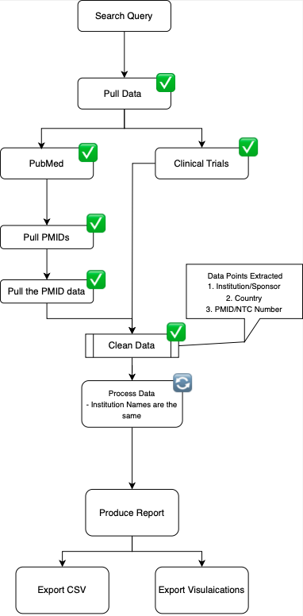

# [Project 1: Pubmed and Clinical Trials - API-Data Extraction](https://github.com/elrf3lipes/Python_Automation_Projects/blob/master/Pubmed_Clinical_Trials_data_extraction_1.ipynb)

## Overview

**Pubmed_Clinical_Trials_data_extraction_1** is a comprehensive data extraction and parsing tool that integrates with [Pubmed](https://www.ncbi.nlm.nih.gov/home/develop/api/) and [ClinicalTrials](https://clinicaltrials.gov/data-api/api) APIs. This project utilizes several powerful Python libraries including Entrez, Medline, Biopython, Requests, urllib, xml.etree, IPython, and Pandas to streamline the process of fetching and processing clinical trials data.



## Features

- **API Integration**: Seamless integration with Pubmed and ClinicalTrials APIs to fetch relevant clinical trials data.
- **Data Parsing**: Efficient parsing of XML data using 'xml.etree'.
- **Data Manipulation**: Advanced data manipulation and analysis using Pandas.
- **Interactive Environment**: Utilizes IPython for an interactive coding experience.

## Libraries Used

- **[Biopython](https://biopython.org/)**: For handling biological data.
- **[Requests](https://pypi.org/project/requests/)**: For making HTTP requests to APIs.
- **[urllib](https://docs.python.org/3/library/urllib.html)**: For URL handling.
- **[xml.etree](https://docs.python.org/3/library/xml.etree.elementtree.html)**: For parsing XML data.
- **[IPython](https://ipython.readthedocs.io/en/stable/)**: For interactive computing.
- **[Pandas](https://pypi.org/project/pandas/)**: For data manipulation and analysis.
- **[Entrez](https://biopython.org/docs/1.75/api/Bio.Entrez.html)**: For accessing NCBI databases.
- **[Medline](https://biopython.org/docs/1.75/api/Bio.Medline.html)**: For parsing Medline records.

## Motivation

I decided to start on Upwork projects just for learning and then present them to the clients, the reason I made it public is because during its development, I encountered numerous posts from people looking for similar solutions. By sharing this tool, I hope to assist others in achieving the same goals of efficiently extracting pubmed and clinical trials research affiliations.

## How to Use

1. Clone the repository:
   
   ```git clone https://github.com/elrf3lipes/Python_Automation_Projects.git```

3. Navigate to the project directory:

   ```cd Python_Automation_Projects```

5. Open the Jupyter Notebook:

   ```jupyter notebook Pubmed_Clinical_Trials_data_extraction_1.ipynb```

Follow the instructions within the notebook to execute the data extraction and parsing processes.

## Conclusion

This project aims to simplify the process of extracting the affiliation data from [Pubmed](https://pubmed.ncbi.nlm.nih.gov/) and [ClinicalTrials](https://clinicaltrials.gov/) APIs. By leveraging powerful Python libraries, it provides a small solution for researchers and developers working in the field of clinical data analysis.

**Note**: The affiliation parser and keyword counter (`extract_phrases_and_countries` function) may encounter many limitations due to varying XML structures from PubMed. I planned to use the OpenAI API to improve parsing, but development stopped when my client went silent. Still, I hope this tool helps others looking for similar solutions!


# [Project 2: Django_concepts](https://github.com/elrf3lipes/Django_concepts)

## Overview

Core concepts of building foundational Django applications and APIs, focusing on RESTful endpoints, user authentication, and seamless data manipulation, with advanced features like content management, comment systems, token authorization and admin integration.

**[Django_API](https://github.com/elrf3lipes/Django_concepts/tree/main/Django_API)** is an API development project leveraging Django's REST framework to create secure, scalable endpoints. This project integrates powerful libraries such as Django REST framework, Django Filters, and DRF's token authentication to implement comprehensive CRUD operations, authentication, pagination, and filtering.

**[Django_blog](https://github.com/elrf3lipes/Django_concepts/tree/main/Django_blog)** is a full-featured blogging platform built with Django, providing user-friendly content management and interactive features. It incorporates Django's built-in authentication system, along with tagging, commenting, and categorization functionalities, making it a versatile tool for managing blog content.

**[import-export](https://github.com/elrf3lipes/Django_concepts/tree/main/import-export)** is a streamlined CRM application focused on data import and export functionality, seamlessly integrated with Django's admin interface. This project utilizes key libraries like Pandas, Django Import-Export, and various file handling modules to facilitate data import/export in formats like CSV and Excel, ensuring smooth data management and validation.
